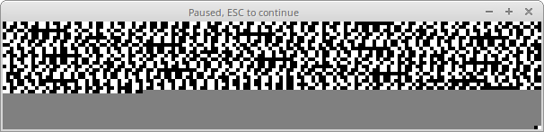
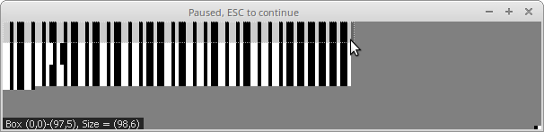
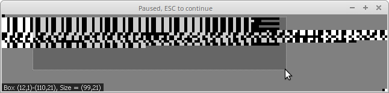

# Binary Vizualizer (BinViz) for GNU Radio Companion
This is a GNU Radio Companion out-of-tree module for visualization of char data types. The BinViz (binary visualizer sink) block provides a GUI component that allows arrangement and display of binary sequences and aims to provide help in reversing and detecting differences between multiple occurrences of bit streams.



Feed the GUI with a decoded stream of 0s and 1s and it will display the relevant bits as white (on) and black (off). Use params width and height to set the dimension of your display. In any case the stream will continue at the upper left corner if it hits the bottom edge.

## Build
```
# cd gr-binviz
# mkdir build
# cd build
# cmake ..
# make
# sudo make install
```
Note: Apart from GNU radio, BinViz depends on the CImg, X11 and pthread libraries.

## Configuration
Parameters start_pattern, end_pattern, drop_pattern allow for justification of how streams are displayed and aligned. These parameters take strings composed of 0s and 1s e.g. 01010101 as a preamble or start pattern. The display will start on a new line for each occurrence of the start pattern. Moreover, on detection of the end pattern the display will wrap to a new line. In case both, the start and end pattern are defined, the display will drop any out-of-bounds bits and only display streams from start to end on a single line each. Moreover, once the start pattern is being detected additional occurrences of the pattern will be ignored until the end is detected.

To get rid of long sequences of zero bytes or arbitrary unwanted bit sequences set the param skip_zero_bytes to true or define a string of 0s and 1s for the drop_pattern to be removed. Note, the params drop_pattern and skip_zero_bytes have precedence over start and end detection patterns.

With a bit of tweaking you get quite nice visual representations of your data.



## Analysis
The display itself allows for some semi-live adjustments and manual analysis. E.g. the mouse wheel on the display allows to zoom-in and zoom-out while new bits are being displayed instantly. Once the display is clicked it will stop painting new bits and display a cursor and its x/y-position. In that mode, one could easily count bits or select part of the bitstream for magnification and closer inspection. Press ESC in order to release and let Binviz paint further bits. During inspection bits are not dropped but held and being painted once ESC is hit.



Hint: Binviz runs as thread. Thus, closing the Binviz window will not stop GRC but stopping GRC will close the Binviz window. Take your screenshots before.

## Parameters

width:
The width of the display in dots. Dots are not equivalent to screen pixels. Binviz applies a hard coded resize factor of four. While the display is shown, use your mouse wheel to resize the dots to your needs.

height:
The height of the display. See width for details.

start_pattern:
A string of 0s and 1s used to detect the start of a bit sequence. The display will wrap to a new line for any occurrence of the start sequence. Note, that in case the start and the end pattern are defined, additional occurrences of the start pattern right after the start pattern but before an end pattern will be ignored.

end_pattern:
A string of 0s and 1s used to detect the end of a bit sequence. The display will wrap to a new line after any occurrence of the end sequence.

drop_pattern:
A string of 0s and 1s used to be dropped. Dropping the string will have precedence over start and end detection. 

skip_zero_bytes:
If set to true will cause that any byte compsed of zero's will be ignored. Ignorance of zero bytes will have precedence over start, end and drop detections.

## Known bugs
### Display Dots
CImgDisplay won't let me draw a grayish panel until a black and a white dot are painted. So it automagically calculates the gray weight/balance of the display. Thus the two pixels at the lower right corner are dummies to get the shading right. Any hints on that will be highly appreciated.
### Build on Ubuntu
Credits: XavierTolza

In some versions of ubuntu the module does not compile correctly, cmake outputs a warning not stopping the compilation but resulting in a non working OOT module
```
===== cmake output fragment =========
-- Checking for module SWIG
-- Disabling SWIG because version check failed.
===== fragment end ==================================
```
When running the module the terminal runs into the following error:
```
AttributeError: 'module' object has no attribute 'vizsink_b'
``` 
The solution found on this bug report is to install the latest version of SWIG:
```
sudo apt install swig swig3.0
```
